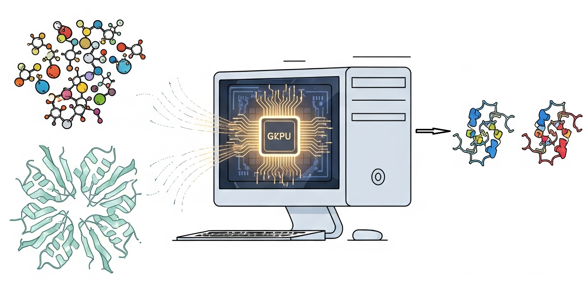

# GPU-Accelerated-Virtual-Screening-with-Vina-GPU
This repository provides a Python script for an efficient, automated molecular docking workflow by integrating Vina-GPU. The pipeline manages the entire process: preparing proteins and ligands, executing docking, and analyzing the results. It also offers flexible configurations for defining the binding pocket and handling output data.

# Features
1.	Automated Protein Preparation: Handles PDB files for protein targets, allowing selection of specific chains or using the first chain found.
2.	Flexible Docking Box Definition:
  •	User-Defined Coordinates: Specify custom center_x/y/z and size_x/y/z for precise docking.
  •	Reference Ligand-Based: Automatically calculates docking box coordinates based on a reference ligand's position in the crystal structure.
  •	Blind Docking: Performs whole-protein blind docking if no specific ligand or coordinates are provided.
3.	Ligand Preparation: Processes ligand SMILES from a CSV file, generating 3D structures using RDKit (with OpenBabel as a robust fallback).
4.	Vina-GPU Integration: Leverages the speed of Vina-GPU for efficient molecular docking.
5.	RMSD Calculation: Calculates RMSD between docked poses and a reference ligand (if provided) for comparative analysis.
6.	Automated Output Management: Generates:
  •	Docking results in a CSV file, including docking scores and RMSD values.
  •	SDF files for docked ligands with assigned bond orders.
  •	Protein-ligand complex PDB files for poses that meet a specified docking score threshold.
7.	Comprehensive Logging & Cleanup: Provides detailed progress updates and cleans up intermediate files after execution.
   
# Requirements
  *	Python >=3.9
  *	MGLTools: Specifically, prepare_receptor4.py and prepare_ligand4.py utilities.
  *	Vina-GPU: The GPU-accelerated version of AutoDock Vina.
  *	Python Libraries:
    •	Numpy
    •	Pandas
    •	Biopandas
   	•	Openbabel
    •	RDKit

# Installation

## Create Conda Environment
* This installs Numpy and Pandas
conda create -n vina_docking python=3.9 -y  

conda install conda-forge::biopandas -y

conda install conda-forge::rdkit -y

conda install conda-forge::openbabel -y

## Install MGLTools: Follow the official MGLTools installation guide. Note down the installation path.
https://ccsb.scripps.edu/mgltools/downloads/

## Install Vina-GPU: Download and compile/install Vina-GPU. Note down the executable path.
https://github.com/ccsb-scripps/AutoDock-GPU

## Usage
Run the script from your terminal:

python docking_pipeline.py --mgl_tools_path /path/to/MGLTools-1.5.7 --vina_path /path/to/Vina-GPU-2-1 --protein_file your_protein.pdb --lig_smiles_file your_ligands.csv [options]

## Arguments
### Required:
* --mgl_tools_path: Path to your MGLTools installation directory (e.g., /home/user/MGLTools-1.5.7).
* --vina_path: Path to your Vina-GPU executable directory (e.g., /home/user/Vina-GPU-2-1).
* --protein_file: Name of your protein/target PDB file (e.g., protein.pdb).
* --lig_smiles_file: Name of the CSV file containing ligand SMILES and IDs (e.g., ligands.csv). The CSV should have columns like 'Compound_ID' and 'Smiles'.

### Optional:
* --chain: Desired chain ID of the protein. If not provided, the script will use the first chain found in the PDB file.
* --lig_id: Ligand ID in the PDB crystal structure. If provided, the docking box will be centered around this ligand. Leave empty for blind docking.
* --number_of_poses: Number of ligand poses to generate (default: 9).
* --threshold: Docking score threshold. Only complexes with a score equal to or below this value will be saved (default: -1.0).
* --gpu_id: Specify the GPU ID to use (e.g., 0, 1). Leave empty for Vina-GPU's default behavior.
* --center_x, --center_y, --center_z: X, Y, Z coordinates for the center of the docking box.
* --size_x, --size_y, --size_z: X, Y, Z dimensions of the docking box.
## $${\color{red}Note:}$$ If lig_id is provided, these explicit center/size arguments will be ignored, and the pocket will be calculated based on the reference ligand. If neither lig_id nor all center/size coordinates are provided, blind docking will be performed.

# Example
### To run a docking simulation with a specific protein chain and a reference ligand, and save poses with a docking score of -7.0 or better:
python docking_pipeline.py \
    --mgl_tools_path /opt/MGLTools-1.5.7 \
    --vina_path /usr/local/bin \
    --protein_file 1iep.pdb \
    --lig_smiles_file my_compounds.csv \
    --chain A \
    --lig_id STI \
    --threshold -7.0

### To perform blind docking on a protein with a docking score of -1.0 or better::
python docking_pipeline.py \
    --mgl_tools_path /opt/MGLTools-1.5.7 \
    --vina_path /usr/local/bin \
    --protein_file 1iep.pdb \
    --lig_smiles_file my_compounds.csv

